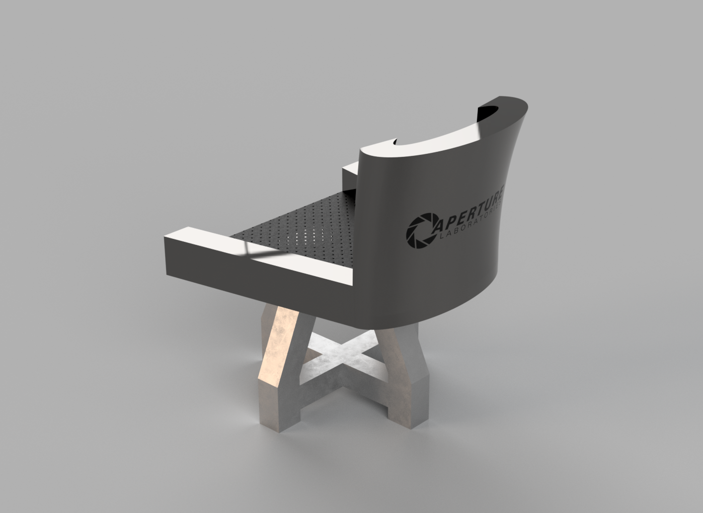
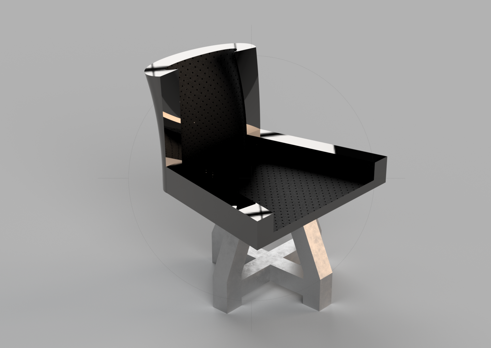

# 3D-Taburete
Diseño y creación virtual de un taburete junto a un visualizador en Unity3D

## Índice 

  - [Proceso creativo](#proceso-creativo)
  - [Visualizador](#visualizador)

## Proceso creativo
Primero diseñé las vistas del taburete que iba a crear, esto tras haber bocetado el taburete y tener ya una idea general de la pinta que iba a tener.

 
 

Para crear el modelo del taburete usaré AutoCad, empezaré creando las piezas por separado, ya que se compondrá de dos soportes encajables y el asiento. A continuación los planos de las piezas del taburete junto con una vista ortogonal:

 

Para crear el respaldar tuve que usar la herramienta de extrusión para superficies 3D y facilitar el proceso

 

Tras este proceso ensamblé las piezas y apliqué texturas al taburete. Aquí decidí que la temática del taburete estaría basada en la del juego de ordenador ***Portal***. A continuación el modelo ya ensamblado:

  
 

En consiguiente hice una caja para el embalaje del taburete con corchos de proteccion usando las herramientas pertinentes para que el corcho no fuera más que un cubo al que se le reste el volumen del propio taburete una vez solapados.

  
 

Y aquí un video del embalaje junto con la caja:

https://www.youtube.com/watch?v=y7mbEG5qH5o
 

Por último un par de renderizados del taburete ya finalizado:

 
 

## Visualizador

Para finalizar el proyecto he creado un pequeño vizualizador del proyecto en Unity3D, dentro de la carpeta Vizualizador que permite rotar el taburete usando el cubo de color blanco ubicado en la parte superior derecha de la pantalla y también ocultar y mostrar las distintas piezas en un menú a la izquierda de la pantalla.

> Nota: Al hacer click en la pieza del taburete directamente se ocultará, y en el menú izquierdo, el botón con el nombre de la pieza lo activa o desactiva mientras que el boton sin nombre al lado de este último desactivará todas las piezas menos la seleccionada.

Para ejecutar el visualizador descargue el proyecto y ejecute `Visualizador.exe`

